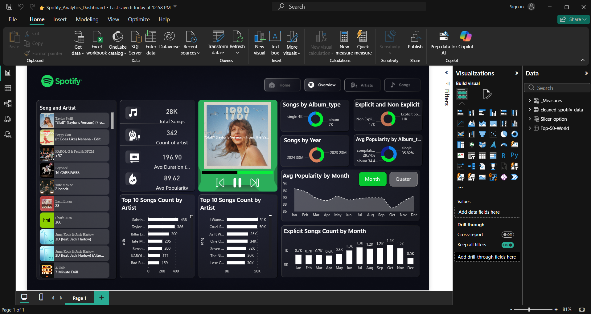

# 🎧 Spotify Data Engineering & Analytics Project

## 📌 Project Overview

This project is an end-to-end data engineering and analytics solution built using MongoDB, Python, and Power BI. The goal of this project is to analyze Spotify music data and generate meaningful insights about songs, artists, and trends.

---

## 🚀 Project Description

In this project, I designed a complete data pipeline starting from raw dataset ingestion to final visualization. The data was first stored in a NoSQL database (MongoDB), then extracted and transformed using Python, and finally visualized using Power BI dashboards.

This project demonstrates practical implementation of both Data Engineering and Data Analytics concepts.

---

## ⚙️ Tech Stack

* MongoDB (Database)
* Python (Pandas, PyMongo)
* Power BI (Dashboard & Visualization)
* Excel (Data Cleaning)

---

## 🔄 Data Pipeline (ETL Process)

CSV Dataset → MongoDB → Python (Data Extraction & Transformation) → Cleaned CSV → Power BI Dashboard

---

## 📊 Dashboard Preview

---

## 🧠 Key Insights

* Medium popularity songs dominate the dataset
* High popularity songs are fewer but impactful
* Explicit content shows a consistent trend over time
* Certain artists contribute significantly to song count

---

## 📂 Project Files

* `fetch_data.py` → Python script for ETL process
* `cleaned_spotify_data.csv` → Processed dataset
* `Spotify_Analytics_Dashboard.pbix` → Power BI dashboard

---

## 🔗 Connect with Me

* 💼 LinkedIn: https://www.linkedin.com/in/yash-sharma-8a04b82b8
* 💻 GitHub: https://github.com/hsaysh

---

## 📌 Conclusion

This project highlights my ability to work with real-world data and implement an end-to-end pipeline using modern data tools. It reflects my skills in data engineering, data transformation, and business intelligence.

---
